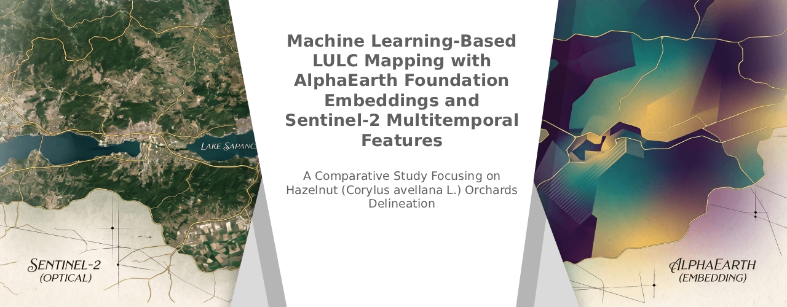

<!--
<p align="center">
  <a href="#">
    
  </a>
  <a href="https://www.python.org/">
    
  </a>
  <a href="https://earthengine.google.com/">
    
  </a>
  <a href="https://www.tandfonline.com/journals/tjde20">
    
  </a>
</p>
-->

**Authors:** Elif Sertel¹², Doğu İlmak³, Samet Aksoy²⁴, Beyza Ustaoğlu⁵

¹ University of California, Los Angeles — The B. John Garrick Institute for the Risk Sciences  
² Istanbul Technical University — Dept. of Geomatics Engineering  
³ Mersin University — Department of Remote Sensing and GIS  
⁴ Linnaeus University — Dept. of Forestry and Wood Technology  
⁵ Sakarya University — Department of Geography

**Corresponding author:** [elifsertel@gmail.com](mailto:elifsertel@gmail.com)

<br>

<details>
<summary><b>Table of Contents</b></summary>

<br>

- [Overview](#overview)
- [Study Area](#study-area)
- [Dataset](#dataset)
- [Feature Configurations](#feature-configurations)
- [Methods](#methods)
- [Performance Metrics](#performance-metrics)
- [Estimated LULC Distribution (Hectares)](#estimated-lulc-distribution-hectares)
- [SHAP Explainability](#shap-explainability)
- [Reproducibility & Data Availability](#reproducibility-data-availability)
- [Citation](#citation)

</details>

<br>

## Overview

This repository provides the complete classification pipelines, feature extraction scripts, hyperparameter configurations, and accuracy assessment code for a systematic comparative evaluation of 64-dimensional **AlphaEarth Foundation (AEF) embeddings** against conventional multitemporal **Sentinel-2** spectral feature sets for **11-class LULC mapping** across Sakarya Province, northwestern Türkiye — one of the world's most extensive hazelnut (*Corylus avellana* L.) production regions. Twenty classification experiments were conducted by pairing four input feature configurations with five machine learning algorithms (Random Forest, XGBoost, LightGBM, LinearSVC, and Decision Tree), demonstrating that AEF embeddings consistently outperform all Sentinel-2-based configurations across every algorithm and evaluation metric, with the best-performing AEF + LightGBM model achieving an overall accuracy of **95.79%** and a weighted F1 score of **0.9566**.

> **Reproducibility note:** The pipeline uses polygon-grouped, spatially-aware data splitting (`GroupShuffleSplit` / `StratifiedGroupKFold`) with fold-safe feature standardization (no train/test leakage), polygon-clustered bootstrap confidence intervals, a complementary spatial-block cross-validation sensitivity check, and explicit SHAP explainer configuration (probability-space where tractable, documented margin-space otherwise). See [Methods](#methods) and [Data Availability](#data-availability) for details.

<br>

## Study Area

**Sakarya Province**, located in the Marmara–Black Sea transition zone of northwestern Türkiye, encompasses a heterogeneous landscape of dense forest, fragmented agricultural lands, urban fabric, wetlands, and water bodies, making it one of Turkey's most complex and thematically rich LULC mapping environments. The province is also among Turkey's leading hazelnut production regions, situated within the broader Black Sea coastal belt where Turkey accounts for more than 70% of global hazelnut output — approximately 747,000 ha under cultivation and 650,000 tonnes produced as of 2023. The study area covers ~48.9 million valid pixels at 10 m spatial resolution and spans 11 spectrally heterogeneous LULC classes, seven of which correspond to distinct forms of vegetated cover, posing a particularly demanding discrimination problem for medium-resolution satellite-based classification.

<br>

## Dataset

### Reference Samples

Training and validation samples were collected as polygon-based reference data for all 11 LULC classes. Spatial splitting was enforced at the **polygon level** (`GroupShuffleSplit`) to prevent data leakage from spatial autocorrelation, and hyperparameter search additionally uses **polygon-grouped stratified 5-fold cross-validation** (`StratifiedGroupKFold`) so that no reference polygon is ever split across folds.

**Table 1.** Reference sample distribution (pixels and polygons) used for model training, validation, and testing.

| Partition | AEF Pixels | AEF Polygons | S2 Pixels | S2 Polygons |
|-----------|:----------:|:------------:|:---------:|:-----------:|
| Training | 549,816 (74%) | 4,387 (72%) | 549,816 (74%) | 4,387 (72%) |
| Validation | 132,004 (18%) | 1,097 (18%) | 132,002 (18%) | 1,097 (18%) |
| Test | 64,856 (9%) | 610 (10%) | 64,856 (9%) | 610 (10%) |
| **Total** | **746,676** | **6,094** | **746,674** | **6,094** |

> A per-class breakdown of polygon count, pixel count, mapped area, and median polygon size for each partition — under both the standard polygon-random split and a complementary geographically-disjoint spatial-block split — is provided in **[tables/TableS1_Class_Partition_Breakdown.xlsx](./tables/)**. The spatial distribution of training/validation/test polygons is shown in **[assets/Figure_S1_Spatial_Distribution.png](./assets/)**.

### LULC Classes (11-class scheme)

`Hazelnut` · `Forest` · `Permanent cropland` · `Arable land` · `Grassland` · `Sparsely vegetated areas` · `Urban fabric` · `Road and rail networks` · `Water courses` · `Water bodies` · `Wetlands`

<br>

## Feature Configurations

### 1. AlphaEarth Foundation (AEF) Embeddings — 64 dimensions

Google DeepMind's **AlphaEarth Foundations** model fuses Sentinel-1/2, Landsat 8/9, PALSAR-2, GEDI LiDAR, ERA5-Land, and GRACE gravity fields into temporally continuous **64-dimensional pixel embeddings** at 10 m resolution. The Space-Time-Precision (STP) encoder enables temporal interpolation and extrapolation without retraining. Embeddings are available on Google Earth Engine as the **Satellite Embedding V1** dataset (2017–2025).

### 2. Sentinel-2 Multitemporal Bands — 20 features

**Table 2.** Multitemporal Sentinel-2 acquisition dates and phenological purposes.

| Date | Season | Purpose |
|------|--------|---------|
| June 19 & 27, 2025 | Peak vegetation growth | Full canopy development |
| October 30, 2025 | Post-harvest / senescence | Phenological separation |

10 spectral bands per date (B2, B3, B4, B5, B6, B7, B8, B8A, B11, B12) resampled to 10 m → **20 features total**.

### 3. Sentinel-2 Spectral Indices — 18 features

Nine indices computed per acquisition date:

**Table 3.** Spectral indices and corresponding biophysical targets utilized for feature engineering.

| Index | Formula | Biophysical Target |
|-------|---------|-------------------|
| NDVIRedEdge | (B8−B5)/(B8+B5) | Vegetation density |
| NDREI | (B6−B5)/(B6+B5) | Canopy chlorophyll |
| RECI | (B7/B5)−1 | Chlorophyll content |
| GCI | (B7/B3)−1 | Green chlorophyll index |
| GNDVI | (B8−B3)/(B8+B3) | Chlorophyll variation |
| GI | B3/B2 | Greenness index |
| NDMI | (B8−B11)/(B8+B11) | Canopy moisture |
| mNDWI | (B3−B11)/(B3+B11) | Surface water |
| NDTI | (B11−B12)/(B11+B12) | Tillage / bare soil |

### 4. Combined Sentinel-2 (Bands + Indices) — 38 features

Full multitemporal stack integrating all spectral bands and indices across both dates.

<br>

## Methods

### Machine Learning Classifiers

**Table 4.** Machine learning classifiers and their key characteristics in the context of the study.

| Classifier | Key Characteristics |
|-----------|-------------------|
| **Random Forest (RF)** | Bootstrap aggregation + feature bagging; robust to multicollinearity |
| **XGBoost** | L1/L2-regularized gradient boosting; sparsity-aware; leads for S2-Bands and S2-Indices |
| **LightGBM** | GOSS + EFB; fastest training; leads for AEF and S2-All feature configurations |
| **LinearSVC** | LIBLINEAR coordinate descent; linear baseline; competitive in high-dimensional AEF space |
| **Decision Tree** | Non-parametric; interpretable baseline; susceptible to overfitting |

All five classifiers are wrapped in a `scikit-learn` `Pipeline` (`StandardScaler` → classifier), so that feature standardization is re-fit within every cross-validation fold — preventing fold-level leakage for scale-sensitive classifiers such as LinearSVC. The final scaler used for evaluation and inference is fit **exclusively on the training partition**.

### Hyperparameter Optimization

Polygon-grouped stratified 5-fold cross-validated grid search (`StratifiedGroupKFold`) on 11,000 balanced samples (1,000 per class) per feature configuration. All experiments use a fixed random seed (`seed = 42`); software package versions and the complete grid-search results for every evaluated hyperparameter combination are provided in **[tables/gridsearch-results/](./tables/gridsearch-results/)** (`{model}_gridsearch_full_results.csv`).

**Table 4a.** Best hyperparameters for the top 6 performing configurations.

| ID | Model | Best Hyperparameters |
|:--:|:------|:----------------------|
| 1 | AEF + LightGBM | `learning_rate=0.1, max_depth=10, n_estimators=200, num_leaves=63` |
| 2 | AEF + XGBoost | `colsample_bytree=0.6, learning_rate=0.1, max_depth=6, n_estimators=200, subsample=1.0` |
| 3 | AEF + Random Forest | `max_depth=20, max_features='sqrt', min_samples_leaf=1, n_estimators=100` |
| 4 | AEF + LinearSVC | `C=0.1` |
| 16 | S2-All + LightGBM | `learning_rate=0.05, max_depth=-1, n_estimators=200, num_leaves=63` |
| 17 | S2-All + Random Forest | `max_depth=20, max_features='sqrt', min_samples_leaf=2, n_estimators=300` |

### Uncertainty Quantification

Two complementary procedures were applied to the test-set predictions of each classifier:

- **Polygon-clustered bootstrap** (1,000 iterations) — reference polygons resampled with replacement to construct 95% confidence intervals for weighted F1 and overall accuracy, preserving spatial dependence rather than treating individual pixels as independent.
- **Repeated random splits** (K = 10) — the full train/validation/test split repeated with 10 independent random seeds (identical hyperparameters) to assess sensitivity to the specific partition realization.

Results are provided in **[tables/bootstrap](./tables/bootstrap)** (`bootstrap_ci_by_model.csv`, `bootstrap_paired_comparison.csv`, `repeated_split_summary.csv`).

### Spatial Block Sensitivity Check

In addition to the standard polygon-random split, a **geographically-disjoint spatial-block split** was implemented (block size determined data-drivenly from the nearest-neighbor distance distribution between polygon centroids) to test sensitivity to the splitting strategy. Results: **[tables/split-sensitivity/](./tables/split-sensitivity/)**.

<br>

## Performance Metrics

<br>

**Table 5.** Summary of the top 6 performing model configurations based on Overall Accuracy.

| Best Model | Overall Accuracy | Weighted F1 | Cohen's κ | MCC |
|:----------:|:----------------:|:-----------:|:---------:|:---:|
| **AEF + LightGBM** | **95.79%** | **0.9566** | **0.9272** | **0.9274** |
| AEF + XGBoost | 95.56% | 0.9541 | 0.9232 | 0.9234 |
| AEF + Random Forest | 95.30% | 0.9508 | 0.9186 | 0.9188 |
| AEF + LinearSVC | 94.37% | 0.9424 | 0.9027 | 0.9029 |
| S2-All + LightGBM | 93.29% | 0.9316 | 0.8841 | 0.8842 |
| S2-All + Random Forest | 93.10% | 0.9286 | 0.8805 | 0.8807 |

> AEF + LightGBM surpasses the best conventional Sentinel-2 configuration (S2-All + LightGBM) by **+2.5 percentage points** in overall accuracy and outperforms widely used global products (ESA WorldCover ~74.4%, Dynamic World ~72%) by a substantial margin.

### Full Results — All 20 Experiments

**Table 6.** Performance metrics for all 20 classification experiments.

| ID | Feature Set | Model | OA | BA | F1 (W) | F1 (M) | κ | MCC |
|:--:|:------------|:------|:--:|:--:|:------:|:------:|:-:|:---:|
| **1** | **AEF** | **LightGBM** | **0.9579** | **0.8282** | **0.9566** | **0.8510** | **0.9272** | **0.9274** |
| 2 | AEF | XGBoost | 0.9556 | 0.8088 | 0.9541 | 0.8381 | 0.9232 | 0.9234 |
| 3 | AEF | Random Forest | 0.9530 | 0.8045 | 0.9508 | 0.8354 | 0.9186 | 0.9188 |
| 4 | AEF | LinearSVC | 0.9437 | 0.8130 | 0.9424 | 0.8142 | 0.9027 | 0.9029 |
| 5 | AEF | Decision Tree | 0.9209 | 0.7522 | 0.9205 | 0.7439 | 0.8641 | 0.8641 |
| 6 | S2-Indices | XGBoost | 0.9149 | 0.7545 | 0.9118 | 0.7700 | 0.8530 | 0.8532 |
| 7 | S2-Indices | Random Forest | 0.9134 | 0.7482 | 0.9107 | 0.7641 | 0.8506 | 0.8508 |
| 8 | S2-Indices | LightGBM | 0.8768 | 0.7930 | 0.8864 | 0.7166 | 0.7977 | 0.8005 |
| 9 | S2-Indices | Decision Tree | 0.8332 | 0.7294 | 0.8500 | 0.6436 | 0.7322 | 0.7372 |
| 10 | S2-Indices | LinearSVC | 0.8149 | 0.7143 | 0.8322 | 0.6254 | 0.7039 | 0.7100 |
| 11 | S2-Bands | XGBoost | 0.9295 | 0.7646 | 0.9260 | 0.7936 | 0.8775 | 0.8778 |
| 12 | S2-Bands | LightGBM | 0.9236 | 0.8092 | 0.9229 | 0.7797 | 0.8687 | 0.8689 |
| 13 | S2-Bands | Random Forest | 0.9243 | 0.7690 | 0.9212 | 0.7840 | 0.8686 | 0.8689 |
| 14 | S2-Bands | Decision Tree | 0.8493 | 0.7324 | 0.8654 | 0.6587 | 0.7514 | 0.7537 |
| 15 | S2-Bands | LinearSVC | 0.8438 | 0.6950 | 0.8580 | 0.6169 | 0.7441 | 0.7471 |
| **16** | **S2-All** | **LightGBM** | **0.9329** | **0.8118** | **0.9316** | **0.8114** | **0.8841** | **0.8842** |
| 17 | S2-All | Random Forest | 0.9310 | 0.7894 | 0.9286 | 0.7903 | 0.8805 | 0.8807 |
| 18 | S2-All | XGBoost | 0.9316 | 0.7758 | 0.9282 | 0.7997 | 0.8812 | 0.8815 |
| 19 | S2-All | LinearSVC | 0.8973 | 0.7710 | 0.8996 | 0.7098 | 0.8260 | 0.8266 |
| 20 | S2-All | Decision Tree | 0.8961 | 0.7399 | 0.8992 | 0.7000 | 0.8230 | 0.8232 |

> **OA** = Overall Accuracy · **BA** = Balanced Accuracy · **F1 (W)** = Weighted F1 · **F1 (M)** = Macro F1 · **κ** = Cohen's Kappa · **MCC** = Matthews Correlation Coefficient

### Key Algorithmic Observations

- **LightGBM and XGBoost** are the strongest ensemble methods overall: LightGBM leads for AEF (OA = 0.9579) and S2-All (OA = 0.9329), while XGBoost leads for S2-Bands (OA = 0.9295) and S2-Indices (OA = 0.9149). All three ensemble methods (LightGBM, XGBoost, Random Forest) consistently rank within the **top three configurations in every dataset group**, indicating that tree-ensemble methods are broadly robust to feature-set choice for this task, with no single algorithm dominating universally.
- **LinearSVC and Decision Tree** consistently trail the ensemble methods, most markedly on the Sentinel-2-based feature sets, reflecting the non-linear separability of the broader 11-class problem.
- **Balanced Accuracy** is markedly lower than Overall Accuracy across all experiments, reflecting inherent class imbalance in real-world LULC distributions — an expected and ecologically meaningful outcome.
- **Cohen's κ and MCC** converge closely across all 20 experiments, confirming metric consistency and ruling out evaluation artifacts.
- **Statistical robustness:** polygon-clustered bootstrap 95% CIs and 10× repeated-split evaluation (see [Methods](#methods)) confirm that the top-model ranking is not an artifact of a single train/test partition.

### 🌰 Focus: Hazelnut Orchard Classification

The best Hazelnut model (**ID 3, AEF + Random Forest**) correctly identified **>94%** of all actual hazelnut pixels in the unseen test set — without any crop-specific model adaptation or fine-tuning.

**Table 7.** Comparative performance of the top AEF vs. Sentinel-2 models specifically for the Hazelnut orchard class.

| Model ID | Feature Set | Classifier | Precision | Recall | **F1-Score** |
|:--------:|:------------|:-----------|:---------:|:------:|:------------:|
| **3** | **AEF** | **Random Forest** | **0.8475** | **0.9428** | **0.8926** |
| 2 | AEF | XGBoost | 0.8610 | 0.9214 | 0.8902 |
| 1 | AEF | LightGBM | 0.8551 | 0.9214 | 0.8871 |
| 17 | S2-All | Random Forest | 0.8420 | 0.8652 | 0.8535 |
| 16 | S2-All | LightGBM | 0.8679 | 0.8715 | 0.8697 |

Comparing the top same-algorithm pairing (AEF + Random Forest vs. S2-All + Random Forest) isolates a **+3.9 percentage point F1 improvement** attributable solely to AEF embeddings. This is attributable to the richer multi-sensor, multitemporal phenological signatures encoded within AEF's latent space that two-date optical imagery cannot fully resolve.

> **Detailed Metrics:** For a comprehensive breakdown of all 20 experiments—including per-class precision, recall, and F1-scores—please refer to the **[tables/](./tables/)** directory.

> **Code:** Training code can be found in **[code/](./code/)**.

<br>

## Estimated LULC Distribution (Hectares)

Pixel-count area estimates across Sakarya Province (~48.9 million valid pixels at 10 m resolution). Values are rounded to the nearest integer.

**Table 8.** Estimated LULC area distribution (hectares) across Sakarya Province derived from top-performing configurations.

| LULC Class | ID 1 (AEF·LGBM) | ID 2 (AEF·XGB) | ID 3 (AEF·RF) | ID 4 (AEF·SVC) | ID 16 (S2·LGBM) | ID 17 (S2·RF) |
|:-----------|----------------:|---------------:|--------------:|---------------:|---------------:|--------------:|
| **Forest** | 187,761 | 193,932 | 213,027 | 180,527 | 189,360 | 219,476 |
| **Hazelnut** | 92,195 | 86,900 | 83,542 | 92,249 | 74,581 | 64,313 |
| **Arable land** | 69,911 | 75,221 | 85,101 | 65,699 | 74,659 | 108,089 |
| **Permanent cropland** | 38,836 | 34,325 | 26,957 | 47,143 | 42,308 | 19,345 |
| **Grassland** | 28,667 | 27,130 | 18,324 | 25,813 | 33,694 | 17,617 |
| **Sparsely vegetated areas** | 22,392 | 23,171 | 13,885 | 24,685 | 25,718 | 14,386 |
| **Discontinuous urban fabric** | 21,279 | 22,022 | 26,299 | 22,013 | 24,683 | 29,225 |
| **Road and rail networks** | 16,371 | 14,981 | 11,240 | 16,499 | 12,410 | 6,670 |
| **Water bodies** | 9,044 | 9,138 | 9,392 | 9,922 | 9,000 | 9,054 |
| **Wetlands** | 1,643 | 1,334 | 815 | 3,326 | 2,007 | 439 |
| **Water courses** | 1,342 | 1,289 | 860 | 1,565 | 1,022 | 827 |

<div align="center">
  
  <p>
    <em><b>Figure 1</b> — Predicted LULC maps across Sakarya Province for the six best-performing model configurations.</em>
  </p>
</div>

### Notable Spatial Patterns

- **Forest** is the dominant land cover in all configurations (180,500–219,500 ha), reflecting dense forestation in the northern and eastern portions of the province.
- **Hazelnut** mapped extents are systematically larger in AEF-based models (83,500–92,200 ha) compared to Sentinel-2 models (64,300–74,500 ha). This divergence likely reflects AEF embeddings capturing broader phenological and structural hazelnut signatures that are otherwise misclassified as Arable land under conventional spectral features.
- **Arable land** is correspondingly larger in S2 models (74,600–108,100 ha) vs. AEF models (65,700–85,100 ha), consistent with the above hypothesis.
- **Water bodies** show the highest inter-model consistency (~9,000–9,900 ha), expected given the strong spectral contrast of open water.
- **Wetlands and water courses** exhibit the highest relative variance, consistent with their small spatial extent, spectral ambiguity, and limited training data.

<br>

## SHAP Explainability

SHAP (SHapley Additive exPlanations) analysis was conducted using `TreeExplainer` at three scales: **global**, **class-specific**, and **local (force plots)**. `model_output`/`feature_perturbation` are configured explicitly rather than left at library defaults: where computationally tractable (per-class training-time analysis), SHAP values are computed in **probability space** with interventional feature perturbation, giving attributions directly comparable within a model; for the full-raster spatial SHAP maps, values remain in **raw margin (log-odds) space** with tree-path-dependent perturbation for computational tractability — magnitudes are therefore *not* directly comparable in probability terms between the AEF and Sentinel-2 raster maps. Explainer configuration is logged to `shap_config.json` / `shap_force_config.json` for every run.

### AEF Embedding Interpretability (Best Model: ID 1 — AEF + LightGBM)

A limited subset of AEF dimensions drives the majority of model discriminative capacity:

| Embedding | Mean \|SHAP\| (probability space) | Role |
|:---------:|:----------------------------------:|:-----|
| **A24** | 0.0117 | Dominant feature — hydrological indicator (Water bodies, Water courses) |
| **A07** | 0.0059 | Vegetation vs. impervious surface discriminator |
| **A51** | 0.0057 | Secondary vegetation structure encoding |

Class-specific SHAP patterns reveal that AEF dimensions function as **semantically interpretable "exclusion filters"**:

- **Forest:** high A07 values → strong positive SHAP; low A07 → Road and rail networks
- **Water bodies & courses:** A24 consistently generates the highest positive SHAP of any feature, consistent with its global dominance above
- **Hazelnut:** discriminated by collective, moderate contributions from A33, A10, A49, A38 — reflecting multi-dimensional phenological encoding
- **Wetlands:** primarily driven by A16 (empirically associated with transitional moisture conditions)
- **Discontinuous urban fabric:** well-separated through A35 and A36

The **spatial distribution of cumulative Hazelnut SHAP values** (raster-scale, margin-space) reveals intensities clustering coherently in the northeastern coastal foothills (~30°45'E–31°E, 40°50'N–41°10'N), tracking intensive orchard cultivation zones — a diagnostic visualization rather than an independent geographic validation, since cumulative SHAP is by construction tied to the model's predicted score.

### Sentinel-2 SHAP Analysis (Baseline: ID 16 — S2-All + LightGBM)

- **NDTI_Jun** emerges as the dominant feature overall, paralleling the role of A24 in the AEF model, though at a substantially smaller SHAP magnitude consistent with the probability-space configuration above
- **NDTI_Oct** provides a reinforcing but secondary contribution
- Hazelnut discrimination relies most on **mNDWI_Jun** and **B4_Jun**, with **B11_Jun** and **NDTI_Jun** as reinforcing multitemporal signals
- Raster-scale spatial SHAP maps (margin-space, see note above) are pending re-generation for the corrected S2-All + LightGBM model (previously reported for S2-All + XGBoost)

<br>

<p align="center">
  
  
</p>

<p align="center">
  <em><b>Figure 2</b> — Spatial distribution of cumulative SHAP values for the Hazelnut class. Left: AlphaEarth LightGBM model (ID 1). Right: Sentinel-2 LightGBM model (ID 16).</em>
</p>

<br>

## Reproducibility & Data Availability

### Computational Environment
All models and explainability analyses were executed in the following software environment, with complete configuration details logged in the [`environment/`](./environment/) directory:

* **Python:** 3.12.13
* **Machine Learning:** scikit-learn (1.6.1), LightGBM (4.7.0), XGBoost (3.4.0)
* **Explainability:** SHAP (0.52.0)
* **Data Processing:** NumPy (2.0.2), Pandas (2.2.2)

### Dataset & Artifact Access
| Resource | Access |
|----------|--------|
| **Sentinel-2 Level-2A** | [Copernicus Open Access Hub](https://scihub.copernicus.eu) · GEE: `COPERNICUS/S2_SR_HARMONIZED` |
| **AlphaEarth Foundation Embeddings** | Google Earth Engine: `Satellite Embedding V1` (2017–2025, 10 m) |
| **Classification code & configs** | This repository |
| **LULC maps (interactive)** | [GEE Web Application](#) *(link to be updated)* |
| **Detailed Metric Tables** | [View Folder](./tables/) |
| **Training Notebooks** | [View Folder](./notebooks/) |
| **Reproducibility artifacts** | Metric summaries, bootstrap CIs, and grid-search results in [`tables/`](./tables/). Software environments and SHAP configs in [`environment/`](./environment/). |

<br>

## Citation

If you use this code or data in your research, please cite:

```bibtex
@article{Sertel2025LULC_AEF,
  title   = {Machine Learning-Based {LULC} Mapping with {AlphaEarth} Foundation Embeddings
             and {Sentinel-2} Multitemporal Features: A Comparative Study Focusing on
             Hazelnut (\textit{Corylus avellana} {L.}) Orchards},
  author  = {Sertel, Elif and Ilmak, Dogu and Aksoy, Samet and Ustaoglu, Beyza},
  journal = {International Journal of Digital Earth},
  year    = {2026},
  note    = {Under review}
}
